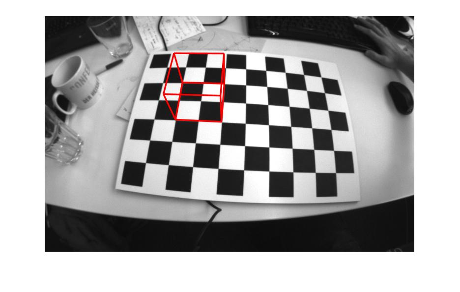
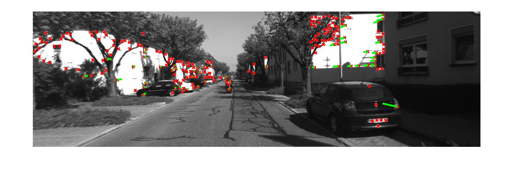
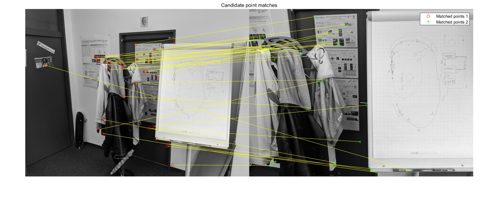
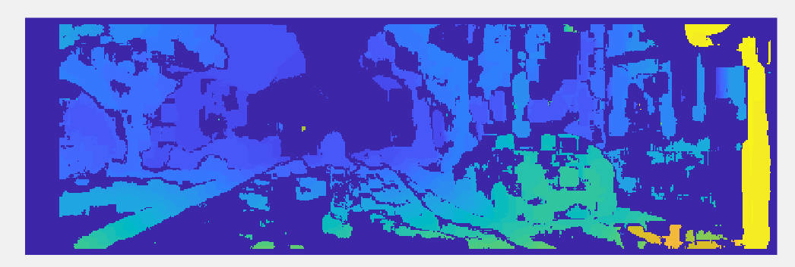

# Vision-Algorithms-for-Mobile-Robotics
The exercise for [Vision Algorithms for Mobile Robotics](http://rpg.ifi.uzh.ch/teaching.html)

Implement in Matlab

## Exercise 1 - Augmented Reality Wireframe Cube

## Exercise 2 - The DLT algorithm

## Exercise 3 - Harris Corner Detection and Keypoint Tracking

## Exercise 4 - SIFT

## Exercise 5 Stereo Dense Reconstruction
